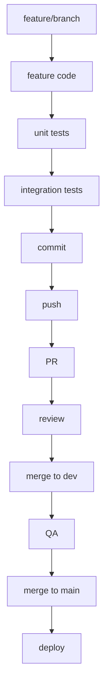

# 🔁 Development Workflow

## 1. 🚀 Create a New Feature Branch

Start from the main or dev branch:

```bash
git checkout dev
git pull origin dev
git checkout -b feature/<feature-name>
```

Example: `feature/technical-indicators` or `feature/add-signal-endpoint`

## 2. 🧱 Develop the Feature

Create modular, testable code inside the appropriate directory (e.g., `feature_engineering/`, `models/`, etc.).

- Follow SOLID principles
- Write with type hints and docstrings
- Format using black, lint with flake8

```bash
# Format code
black .

# Check for linting issues
flake8 .
```

## 3. 🧪 Write Unit Tests

Create tests in the `tests/unit/` directory. Use pytest for all test cases.

```python
# Example: tests/unit/test_moving_average.py
def test_moving_average():
    assert moving_average([1, 2, 3], window=2) == [None, 1.5, 2.5]
```

Run the tests:

```bash
pytest tests/unit/
```

Ensure >90% code coverage using coverage.py:

```bash
coverage run -m pytest
coverage report -m
```

## 4. 🧩 Create/Update API Endpoint (if needed)

If the feature requires exposure through an API:

- Add route in `api/routes/feature_name.py`
- Update `main.py` to include the router

```python
# Example FastAPI endpoint
@router.get('/signals')
def get_signals():
    return {"signal": "BUY"}
```

Test endpoint locally:

```bash
uvicorn main:app --reload
```

Check on browser or via:

```bash
curl http://localhost:8000/signals
```

## 5. ✅ Integration & End-to-End Tests

Add relevant tests in `tests/integration/` or `tests/e2e/`.

```bash
pytest tests/integration/
pytest tests/e2e/
```

## 6. 📦 Commit, Push, and Open Pull Request

```bash
git add .
git commit -m "Add technical indicator and endpoint"
git push origin feature/<feature-name>
```

Open a Pull Request (PR) into dev on GitHub.

- Include description, screenshots (if API), and tests
- Wait for code review and CI checks

## 7. 🔀 Merge & Rebase

Once approved:

```bash
git checkout dev
git pull origin dev
git merge feature/<feature-name>
git push origin dev
```

Optionally: rebase main after QA testing is complete.

## 8. 🚢 Deploy

### Option A: Local Docker Deployment

```bash
docker build -t quant-trading .
docker run -p 8000:8000 quant-trading
```

### Option B: Remote Deployment (e.g., via GitHub Actions)

- On push to main, trigger CI/CD pipeline
- Run `docker-compose.prod.yml` or deploy to cloud (e.g., EC2, Render, Azure)

## 9. 🔍 Post-Deployment Checks

- Verify endpoint is live
- Monitor logs via loguru or deployment platform
- Run smoke tests

## ✅ Summary Flowchart

